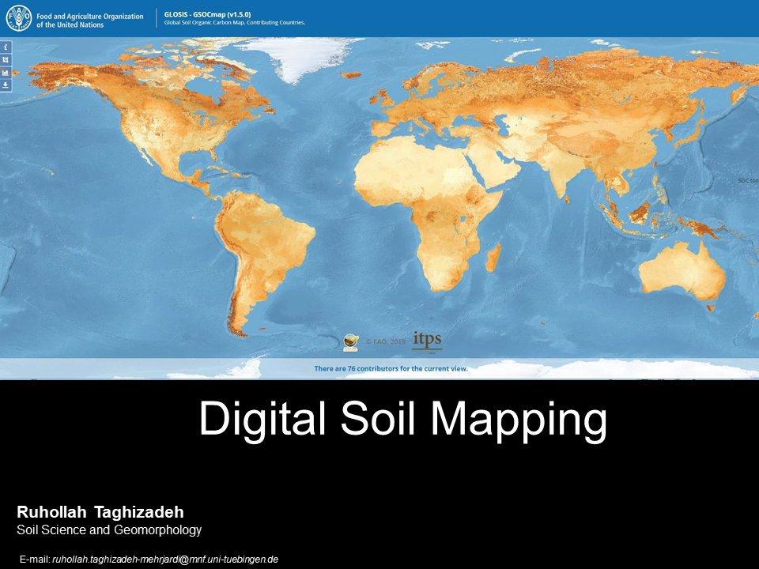

# Workshop Digital Soil Mapping in R Programming
## Materials and R codes for digital soil mapping workshop which was held at the Iranian Soil & Water Research Institute. 

	

### 1. An Introduction of Digital Soil Mapping

### 2. R basics

### 3. How to preprocess the geodatabases, remote sensing, and digital elevation models

### 4. How to extract spatial information and predict soil properties using simple models

### 5. How to extract spatial information and predict soil properties using advanced machine learning models

### 6. How to use geostatistics for mapping soil properties

### 7. Advanced topics of digital soil mapping

### 8. An overview of Digital soil mapping 
